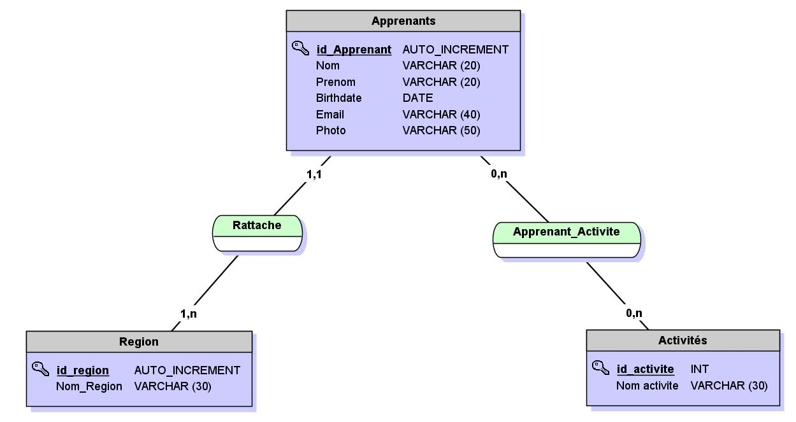
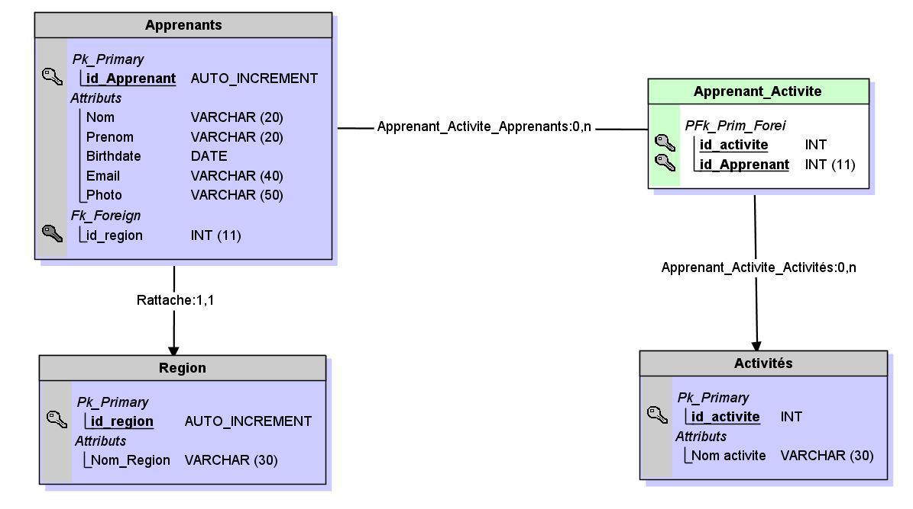
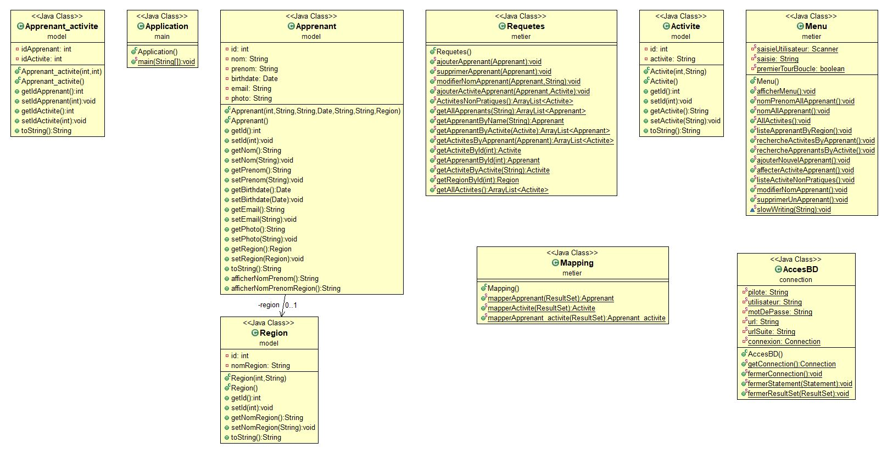

# EvalSession2
Évaluation fin de session 2 Simplon. 
Création d'une base de données et d'une application qui propose un menu afin de faire des requêtes sur les tables de cette base de données.

Longueville Thomas & Tressous Cédric

# MCD 

# MLD

# Diagramme de classes

# Exemple de code

<pre class = "brush:java ;"><code>
  /**
	 * Méthode pour retourner une liste d'activites non pratiqués par les apprenants.
	 */
	public static ArrayList<Activite> ActivitesNonPratiques() throws SQLException, ClassNotFoundException {
		
		Statement statement = null;
		String requete	= "select * from activites left join apprenant_activite on activites.ID_ACTIVITE = apprenant_activite.ID_ACTIVITE where apprenant_activite.ID_ACTIVITE IS NULL";
		statement = AccesBD.getConnection().createStatement();
		ResultSet resultat = statement.executeQuery(requete);
		ArrayList<Activite> listActiviteNonPratiques = new ArrayList<>();
		while(resultat.next())
		{
			Activite activite = Mapping.mapperActivite(resultat);
			listActiviteNonPratiques.add(activite);
		}
		
		return listActiviteNonPratiques;
	}
  </code></pre>
